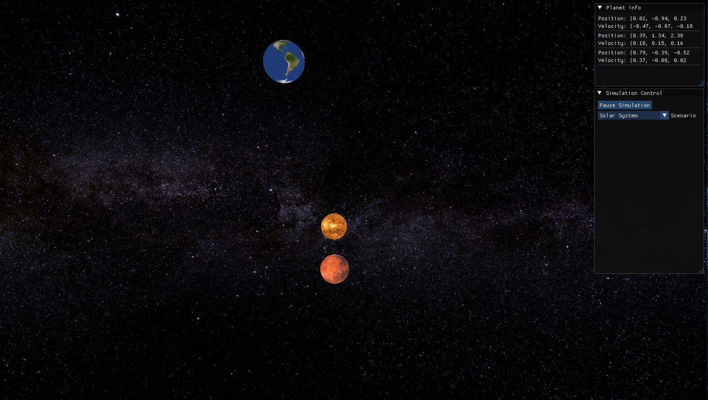

# Universe Studio
A 3D Gravity simulation software written in C++
 
> [!IMPORTANT]
> This projects is in early development stage

## Build
1. Clone the repository using `git clone https://github.com/LuizSudo/UniverseStudio.git`
2. Install the Dependencies
3. cd into `universtudio`
4. run `mkdir build && cmake -B build`
5. cd into `build` directory and run `make` for build the project

## Dependencies
- OpenGL
- GLFW
- GLM
- Assimp

### License
See [License](LICENSE) file for more details
